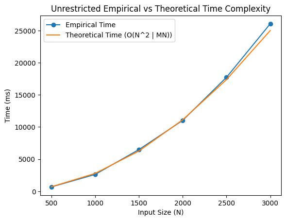
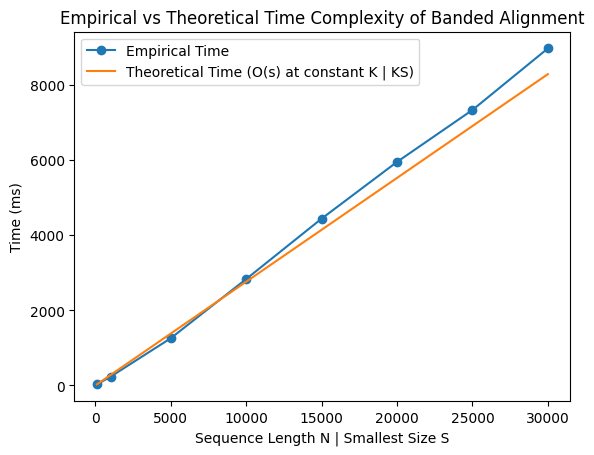

# Project Report - Alignment

## Baseline

### Design Experience

I did this with Spencer Zaugg on 10/27/2025.

My plan is to use an np.array to store the memoized data of the edit distance for different substrings. I will initialize it by filling in the base cases and side base cases. For back pointers, I will use a hash map to point each entry ij of the matrix to its previous entry that it descended from. I will keep this map updated as I fill in entries.

After finding the bottom right corner of the matrix. I will then recurse through the back pointer dictionary to assemble the reverse order of operations. After that, I will iterate over those in reverse order and apply the necessary adjustments to both strings depending on if it was diagonal, down, right. This should make it O(mn).

He wanted to use a numpy array.

### Theoretical Analysis - Unrestricted Alignment

#### Time 

##### align - **O(mn)**

For my analysis, m will be the length of the first string, and n will be the length of the second.

```py
calculator = AlignmentCalculator(seq1, seq2, banded_width, # O(m)
                                indel_penalty, match_award, 
                                sub_penalty, gap_open_penalty)
dist, prev = calculator.calculate_matrix() # O(mn) see below
edits = get_edit_sequence(seq1, seq2, prev) # O(m + n) see below
aligned_seq1, aligned_seq2 = get_sequence_alignment(seq1, seq2, gap, edits) # O(m + n)
score = math.inf if aligned_seq1 is None else dist[len(seq1)-1][len(seq2)-1] # O(1)
return score, aligned_seq1, aligned_seq2
```

I have not include the parameters and the rest of the method signature because its really big. This align function instantiates an AlignmentCalculator object (I did this to avoid code duplication and have better design) and uses it to calculate both the distance adjacency list and the back pointer prev adjacency list.

Both of these operations are O(m) and O(mn) respectively (see my analysis of those functions below). Getting the sequence of edits and reconstructing the alignment sequence are both O(m+n) (see below).

This means that the AlignmentCalculator.calculate_matrix() function defines our big O at **O(mn)**

```py
class AlignmentCalculator:
    def __init__(self, seq1, seq2, 
                 banded_width, indel_penalty, 
                 match_award, sub_penalty, gap_open_penalty):
        self.seq1 = seq1
        self.seq2 = seq2
        self.banded_width = banded_width
        self.indel_penalty = indel_penalty
        self.match_award = match_award
        self.sub_penalty = sub_penalty
        self.gap_open_penalty = gap_open_penalty
        self.dist = {i: {} for i in range(-1, len(self.seq1))} # O(m)
        self.prev = {}
        self.mode = {i : {} for i in range(-1, len(self.seq1))} # O(m)
```

For initialization, we simply assign references to input values. However, it does m operations to initialize our distance and mode matrices.

```py
def calculate_matrix(self):
        for i, j in self.position_iterator(): # O(mn)
            self.calculate_distance(i, j) # O(1)
        return self.dist, self.prev

def position_iterator(self):
    if self.banded_width == -1:
        for i in range(-1, len(self.seq1)):    #O(mn)
            for j in range(-1, len(self.seq2)):
                yield i, j
    else:
        for i in range(-1, len(self.seq1)):    # Explained in Core
            j_start = max(-1, i - self.banded_width)
            j_end = min(len(self.seq2) - 1, i + self.banded_width)
            for j in range(j_start, j_end + 1):
                yield i, j~
```

Here, we see that our matrix calculation function simply loops over all m * n positions in the dynamic programming matrix. This means that this function will scale by at least O(mn). See my justification of the calculate_distance function as being constant time below.

```py
def calculate_distance(self, i, j):
    if i == -1 and j == -1: # O(1)
        self.dist[i][j] = 0
        self.mode[i][j] = "m"
    elif i == -1:               # O(1)
        gap_modifier = self.gap_open_penalty if j == 0 else 0
        self.dist[i][j] = self.dist[i][j-1] + self.indel_penalty + gap_modifier
        self.prev[i, j] = (i, j-1)
        self.mode[i][j] = "i"
    elif j == -1:     # O(1)
        gap_modifier = self.gap_open_penalty if i == 0 else 0
        self.dist[i][j] = self.dist[i-1][j] + self.indel_penalty + gap_modifier
        self.prev[i, j] = (i-1, j)
        self.mode[i][j] = "d"
    else:
        self.get_best_distance(i, j) # O(1)
```

In this functions, the operations that are taking place are all constant time. We have several comparisons and floating point arithmetic, so we consider those to be constant. Reading and accessing a hashmap data structure is also a constant time operation. I have justified the get_best_distance method below.

```py
def get_best_distance(self, i, j):
    left_scenario, diag_scenario, min_scenario = self.get_scenarios(i, j) # O(1)
    if min_scenario == diag_scenario: # O(1)
        self.prev[i, j] = (i-1, j-1)
        self.mode[i][j] = "m"
    elif min_scenario == left_scenario: # O(1)
        self.prev[i, j] = (i, j-1)
        self.mode[i][j] = "i"
    else: # O(1)
        self.prev[i, j] = (i-1, j)
        self.mode[i][j] = "d"
```

Similar to the other example. This function only performs hash table lookups and floating point arithmetic operations. This functions remains constant time. See get_scenarios below.

```py
def get_scenarios(self, i, j):
    if j in self.dist[i-1]: # O(1)
        gap_modifier = self.gap_open_penalty if self.mode[i-1][j] != "d" else 0
        up_scenario = self.dist[i-1][j] + self.indel_penalty + gap_modifier
    else: # O(1)
        up_scenario = math.inf
    if j-1 in self.dist[i]: # O(1)
        gap_modifier = self.gap_open_penalty if self.mode[i][j-1] != "i" else 0
        left_scenario = self.dist[i][j-1] + self.indel_penalty + gap_modifier
    else: # O(1)
        left_scenario = math.inf
    diag_modifier = self.match_award if self.seq1[i] == self.seq2[j] else self.sub_penalty
    diag_scenario = self.dist[i-1][j-1] + diag_modifier # O(1)
    min_scenario = min(up_scenario, left_scenario, diag_scenario) # O(1)
    self.dist[i][j] = min_scenario # O(1)
    return left_scenario, diag_scenario, min_scenario
```

This only thing noteworthy here is calculating the minimum, which will always be of only three values. The rest of the operations are simple hash table lookups and variable reference reassignments. This make the function constant time. Because all the constituent function that calculate_distance depends on run in constant time (and it only performs constant time operations using these functions), it means that calculate_distance must be constant time as well.

```py
def get_edit_sequence(seq1, seq2, prev):
    rev_edits = []
    i, j = len(seq1) - 1, len(seq2) - 1 # O(1)
    while True:  # O(m + n) see below
        if not prev.get((i, j)): # O(1)
            break
        i_prev, j_prev = prev[(i, j)]
        if i_prev == i - 1 and j_prev == j - 1:  # O(1)
            rev_edits.append("sub")
        elif i_prev == i and j_prev == j - 1:  # O(1)
            rev_edits.append("ins")
        else:                                 # O(1)
            rev_edits.append("del")
        i, j = i_prev, j_prev
    edits = rev_edits[::-1] #O(m + n)
    return edits
```

We now examine the time complexity for computing the sequence of edits prior to assemble the sequence itself. As we recurse (logically, not by functional recursion) through the prev back pointer hash map, each recursion through is a constant time operation. This is because its simply hash map lookups and edits.

However, we have to understand that the maximum amount of times we iterate through the while loop is bounded by the maximum number of edits. This must then logically be the height of our matrix m + the width of the matrix n. This is because m + n is the worst case scenario for alignment. This makes this function bound by O(m + n)

```py
def get_sequence_alignment(seq1, seq2, gap, edits):
    if (not edits) and (len(seq1) != 0 and len(seq2) != 0):
        return None, None
    aligned_seq1, aligned_seq2 = "", ""
    seq1_shifts, seq2_shifts = 0, 0
    for edit in edits: # O(m + n)
        if edit == "sub":
            aligned_seq1 += seq1[seq1_shifts]
            aligned_seq2 += seq2[seq2_shifts]
            seq1_shifts += 1
            seq2_shifts += 1
        elif edit == "ins":
            aligned_seq1 += gap
            aligned_seq2 += seq2[seq2_shifts]
            seq2_shifts += 1
        else:
            aligned_seq1 += seq1[seq1_shifts]
            aligned_seq2 += gap
            seq1_shifts += 1
    return aligned_seq1,aligned_seq2
```

Within each iteration, the operations are trivial constant time hash table lookups and increments. This means that this function is bound by the number of edits that have happened. We established previously that the maximum edits it m + n. That makes this function O(m + n)

Between all the high level functions and operations of this algorithm, its clear that the calculate_matrix() function defines the big O for this algorithm. That means that algin has a time complexity of **O(mn)**

#### Space

##### align - **O(mn)**

```py
calculator = AlignmentCalculator(seq1, seq2, banded_width, # see below
                                indel_penalty, match_award, 
                                sub_penalty, gap_open_penalty)
dist, prev = calculator.calculate_matrix() # O(mn)
edits = get_edit_sequence(seq1, seq2, prev) # O(mn)
aligned_seq1, aligned_seq2 = get_sequence_alignment(seq1, seq2, gap, edits) # O(m + n)
score = math.inf if aligned_seq1 is None else dist[len(seq1)-1][len(seq2)-1]
return score, aligned_seq1, aligned_seq2
```

The distance and previous matrices take up O(mn) space because they represent m x n matrices. The aligned sequences themselves are bound by the total number of edits manuevers in the algorithm, which is O(m + n). I will examine the AlignmentCalculator space separately.

```py
class AlignmentCalculator:
    def __init__(self, seq1, seq2, 
                 banded_width, indel_penalty, 
                 match_award, sub_penalty, gap_open_penalty):
        self.seq1 = seq1
        self.seq2 = seq2
        self.banded_width = banded_width
        self.indel_penalty = indel_penalty
        self.match_award = match_award
        self.sub_penalty = sub_penalty
        self.gap_open_penalty = gap_open_penalty
        self.dist = {i: {} for i in range(-1, len(self.seq1))} # O(mn)
        self.prev = {}                                         # O(mn)
        self.mode = {i : {} for i in range(-1, len(self.seq1))}
```

We see that the AlignmentCalculator has the dist, prev (I will discuss mode in core, but just know that ir grows to mn too), which take up O(mn) space. This is what eventually gets returned.

```py
def calculate_matrix(self):
        for i, j in self.position_iterator(): #O(1)
            self.calculate_distance(i, j)
        return self.dist, self.prev

def position_iterator(self):
    if self.banded_width == -1:
        for i in range(-1, len(self.seq1)):
            for j in range(-1, len(self.seq2)):
                yield i, j                        #O(1)
    else:
        for i in range(-1, len(self.seq1)):
            j_start = max(-1, i - self.banded_width)
            j_end = min(len(self.seq2) - 1, i + self.banded_width)
            for j in range(j_start, j_end + 1):
                yield i, j                        #O(1)
```

As a construction itself, the iterator takes constant space because it doesn't store all the values in any data structure: it simply evaluates the next iteration when asked. In a for loop, the previous values are garbage collected by the python virtual machine. This makes these functions constant in space.

```py
def calculate_distance(self, i, j): # O(1) see below
    if i == -1 and j == -1:
        self.dist[i][j] = 0
        self.mode[i][j] = "m"
    elif i == -1:
        gap_modifier = self.gap_open_penalty if j == 0 else 0
        self.dist[i][j] = self.dist[i][j-1] + self.indel_penalty + gap_modifier
        self.prev[i, j] = (i, j-1)
        self.mode[i][j] = "i"
    elif j == -1:
        gap_modifier = self.gap_open_penalty if i == 0 else 0
        self.dist[i][j] = self.dist[i-1][j] + self.indel_penalty + gap_modifier
        self.prev[i, j] = (i-1, j)
        self.mode[i][j] = "d"
    else:
        self.get_best_distance(i, j)
```

This only modifies member data structures, which we have already established are O(mn) in space. All the intermediary values for computation here are fixed and do not scale. They are therefore constant in space.

```py
def get_best_distance(self, i, j): # O(1)
    left_scenario, diag_scenario, min_scenario = self.get_scenarios(i, j)
    if min_scenario == diag_scenario:
        self.prev[i, j] = (i-1, j-1)
        self.mode[i][j] = "m"
    elif min_scenario == left_scenario:
        self.prev[i, j] = (i, j-1)
        self.mode[i][j] = "i"
    else:
        self.prev[i, j] = (i-1, j)
        self.mode[i][j] = "d"
```

This is the exact same. It simply store a few intermediary values but nothing that scales with our variables, so this is constant.

```py
def get_scenarios(self, i, j): # O(1)
    if j in self.dist[i-1]:
        gap_modifier = self.gap_open_penalty if self.mode[i-1][j] != "d" else 0
        up_scenario = self.dist[i-1][j] + self.indel_penalty + gap_modifier
    else:
        up_scenario = math.inf
    if j-1 in self.dist[i]:
        gap_modifier = self.gap_open_penalty if self.mode[i][j-1] != "i" else 0
        left_scenario = self.dist[i][j-1] + self.indel_penalty + gap_modifier
    else:
        left_scenario = math.inf
    diag_modifier = self.match_award if self.seq1[i] == self.seq2[j] else self.sub_penalty
    diag_scenario = self.dist[i-1][j-1] + diag_modifier
    min_scenario = min(up_scenario, left_scenario, diag_scenario)
    self.dist[i][j] = min_scenario
    return left_scenario, diag_scenario, min_scenario
```

As you can see, this is merely an extension of what we have seen before. The member data structure are modified up to O(mn) space, but this function itself only needs a fixed number of intermediary values for the computation. This is also O(1) space.

```py
def get_sequence_alignment(seq1, seq2, gap, edits): # O(m + n)
    if (not edits) and (len(seq1) != 0 and len(seq2) != 0):
        return None, None
    aligned_seq1, aligned_seq2 = "", ""
    seq1_shifts, seq2_shifts = 0, 0
    for edit in edits:  # (m + n)
        if edit == "sub":
            aligned_seq1 += seq1[seq1_shifts]
            aligned_seq2 += seq2[seq2_shifts]
            seq1_shifts += 1
            seq2_shifts += 1
        elif edit == "ins":
            aligned_seq1 += gap
            aligned_seq2 += seq2[seq2_shifts]
            seq2_shifts += 1
        else:
            aligned_seq1 += seq1[seq1_shifts]
            aligned_seq2 += gap
            seq1_shifts += 1
    return aligned_seq1,aligned_seq2  # O(2m + 2n)
```

We have a fixed set of values used for intermediary computation that are garbage collected at each iteration of the for loop. However, we are storing both the edits, of which there are O(m + n) maximum, and the aligned sequences, which would then be O(2m + 2n) at the maximum.

Because of this intermediary storing of the edits and sequences, this function has a space complexity of O(m + n)

```py
def get_edit_sequence(seq1, seq2, prev):
    rev_edits = []
    i, j = len(seq1) - 1, len(seq2) - 1
    while True:
        if not prev.get((i, j)):
            break
        i_prev, j_prev = prev[(i, j)]
        if i_prev == i - 1 and j_prev == j - 1:
            rev_edits.append("sub")
        elif i_prev == i and j_prev == j - 1:
            rev_edits.append("ins")
        else:
            rev_edits.append("del")
        i, j = i_prev, j_prev
    edits = rev_edits[::-1] # O(m + n)
    return edits
```

This is largely repetition of what I said before. The reversal of the edits and the edits themselves both take up O(m + n) space because that is the maximum number of edits.

To conclude, we see that the adjacency list data structures grow the most in the AlignmentCalculator. This then binds the Big O space complexity for the whole align function. I conclude that this would then be **O(mn)** space.

### Empirical Data - Unrestricted Alignment

| N    | time (ms) |
|------|-----------|
| 500  |  671      |
| 1000 |    2618   |
| 1500 |    6480   |
| 2000 |   11020   |
| 2500 |   17720   |
| 3000 |   26050   |


### Comparison of Theoretical and Empirical Results - Unrestricted Alignment

- Theoretical order of growth: **O(mn)**
- Empirical order of growth (if different from theoretical): **O(mn)**
- Constant of Proportionality: 0.002777774074074074




As you can see here, my empirical was a near perfect match to my theoretical. For my testing, because the empirical table is one dimensional, I made the graph only vary by N for simplicity as well. This is still completely valid because N is still a manifestation of both m and n.

So we see that N^2 is effectively m * n in this context. This was exactly as a predicted. This algorithm runs in quadratic time because the whole m x n Matrix (in this case simply N x N Matrix).

## Core

### Design Experience

I did this with Spencer Zaugg on 10/27/2025.

Instead of using an mxn matrix to store the information. I will use a hashmap instead. I anticipate that the best thing to do would be to have the keys and values be integers to correspond to the index of each respective string in the theoretical matrix.

However, in my iteration, I will not iterate over all points. I will make my iteration smart enough to only iterate over the banded section and only consider the two(in the edge cases) side available to it.

I will still maintain a hashmap of back pointers as usual, but I will need to reformat the dictionary keys and values with some delimiter (likely a tuple) to make sure that no data is lost. I will then use this hashmap to construct the alignments.

He also wanted to use a dictionary.

### Theoretical Analysis - Banded Alignment

#### Time 

##### align - **O(ks)**

My analysis will be in reference to m as the first sequence, n as the second sequence, and s as the shorter sequence.

```py
calculator = AlignmentCalculator(seq1, seq2, banded_width,   # O(m)
                                indel_penalty, match_award, 
                                sub_penalty, gap_open_penalty)
dist, prev = calculator.calculate_matrix()  # O(ks)
edits = get_edit_sequence(seq1, seq2, prev) # O(m + n)
aligned_seq1, aligned_seq2 = get_sequence_alignment(seq1, seq2, gap, edits) # O(m + n)
score = math.inf if aligned_seq1 is None else dist[len(seq1)-1][len(seq2)-1]
return score, aligned_seq1, aligned_seq2
```

I have justified the instantiation of the AlignmentCalculator in the previous section. I won't do it here because it would be the same thing. That instantiation is simply O(m). However, the matrix calculation is now O(ks) where k is the bandwidth and s is the length of the shorter sequence. I will justify why computing the number of edits is the same O(m + n).

The calculate_matrix() function still dominates because it is multiplicative with O(ks), making our time complexity **O(ks)**.

```py
def calculate_matrix(self):
        for i, j in self.position_iterator():
            self.calculate_distance(i, j)
        return self.dist, self.prev

def position_iterator(self):
    if self.banded_width == -1:
        for i in range(-1, len(self.seq1)):
            for j in range(-1, len(self.seq2)):
                yield i, j
    else:
        for i in range(-1, len(self.seq1)):      # O(ks) See below
            j_start = max(-1, i - self.banded_width)
            j_end = min(len(self.seq2) - 1, i + self.banded_width)
            for j in range(j_start, j_end + 1):
                yield i, j
```

Everything from the previous phase is the exact same except for this position iterator. For that reason, I **wont repeat everything** from that previous phase.

It's a little difficult to visualize why exactly the number of values we iterate over scales with O(ks). If we examine a matrix with a bandwidth of 5, it essentially creates a diagonal rectangle inside of our matrix. We calculate the area of a rectangle by taking width * height = area.

k is the number of cells per level of that rectangle because its the width of each band that gets created. So, s is the height because its the number of bands (kind of). While s isn't necessarily the number of bands, it makes logical sense that the overall shape of the rectangle will scale with the smallest string. For example, if my s is length 1, it will necessary constrict the width to be length 1.

We can then assume that there will be approximately s * (2k + 1) iterations. This then settles down to a time complexity of O(ks)

```py
def get_edit_sequence(seq1, seq2, prev): # O(m + n) see below
    rev_edits = []
    i, j = len(seq1) - 1, len(seq2) - 1
    while True:
        if not prev.get((i, j)):
            break
        i_prev, j_prev = prev[(i, j)]
        if i_prev == i - 1 and j_prev == j - 1:
            rev_edits.append("sub")
        elif i_prev == i and j_prev == j - 1:
            rev_edits.append("ins")
        else:
            rev_edits.append("del")
        i, j = i_prev, j_prev
    edits = rev_edits[::-1]
    return edits
```

To justify why getting the edit sequence (and by extension, computing the strings which is bound by the length of the edit sequence) is still O(m + n), I will abstract this as being a manhattan distance problem.

In our matrix, our bands will at most shift one to the left each time. In our worst case, we could be deleting, inserting, deleting again, and doing any number of straight insertions or deletions to arrive at the corner. The issue is that when we successively do insertions followed by deletions as we make our way diagonally down the matrix, the number of edits (or travels) must be the manhattan (or taxicab) distance between those points.

When we calculate manhattan distance in this diagonal fashion, it makes no difference whether or not we shift down and to the right each time or if we simply add up the lengths of the sides in question. Because of this, we can conclude that the manhattan distance between the top corner and the bottom corner is simply m + n. Because of this, we are still bound by O(m + n) here.

To conclude, the O(ks) multiplicative case will dominate over over the edit iteration O(m + n). This is because even in prohibitively smaller instances of k, the manhattan distance will be squashed. For that reason, my analysis is that it will be **O(ks)** time.

#### Space

##### align - **O(ks)**

Again, this code is essentially the same as the previous phase, so **I will not repeat anything** that is not built on or changed by the band algorithm.

```py
calculator = AlignmentCalculator(seq1, seq2, banded_width, 
                                     indel_penalty, match_award, 
                                     sub_penalty, gap_open_penalty) # O (m)
dist, prev = calculator.calculate_matrix() # O(ks)
edits = get_edit_sequence(seq1, seq2, prev) # O(m + n)
aligned_seq1, aligned_seq2 = get_sequence_alignment(seq1, seq2, gap, edits) # O(m + n)
score = math.inf if aligned_seq1 is None else dist[len(seq1)-1][len(seq2)-1]
return score, aligned_seq1, aligned_seq2
```

The initial instantiation of data structures in AlignmentCalculator is the exact same with O(m) for clear reasons, so I wont repeat over it. However, the dist and prev dictionaries are now simply O(ks) in space instead of O(mn). I will go over this. For reasons explained above, the number of edits remains bound by O(m + n). We see here that space complexity should be **O(ks)**

```py
def calculate_matrix(self):
        for i, j in self.position_iterator(): # O(ks)
            self.calculate_distance(i, j)
        return self.dist, self.prev

def position_iterator(self):
    if self.banded_width == -1:
        for i in range(-1, len(self.seq1)):
            for j in range(-1, len(self.seq2)):
                yield i, j
    else:                                   # O(ks)
        for i in range(-1, len(self.seq1)):
            j_start = max(-1, i - self.banded_width)
            j_end = min(len(self.seq2) - 1, i + self.banded_width)
            for j in range(j_start, j_end + 1):
                yield i, j
```

This is the only meaningful function that is impacted by the banded algorithm. Because of that, I won't repeat over the other ones.

As I explained previously in the time analysis, the number of values we iterate over is bounded by O(ks). This also means that our data structures prev, dist, and mode also grow to be bounded by O(ks). Because of this, this function to fill out these matrices should have a space complexity of O(ks).

That being said. The space complexity of this AlignmentCalculator object must grow to be bounded by O(ks). This O(ks) will dominate over the O(m + n) from the edit sequence computation (I already went over why the data structure storing the edit sequence is still O(m + n)). Our final space complexity for the banded algorithm is then **O(ks)**.

### Empirical Data - Banded Alignment

I ran this analysis at a constant k, bandwidth, of 50.

| N     | time (ms) |
|-------|-----------|
| 100   |   25.86   |
| 1000  |   231.0   |
| 5000  |    1258   |
| 10000 |    2835   |
| 15000 |    4444   |
| 20000 |    5955   |
| 25000 |    7339   |
| 30000 |    8979   |

### Comparison of Theoretical and Empirical Results - Banded Alignment

- Theoretical order of growth: **O(ks)**
- Empirical order of growth (if different from theoretical): **O(ks)**
- Constant of Proportionality: 0.005528941666666666




As you can see, my empirical matches nearly perfectly with the theoretical. I ran these measurement at varying string length N (s in the case of my theoretical) and at a constant bandwidth k = 50. We would expect that the trend would be linear at constant k and varying N, and this is exactly what we see.

It took the unrestricted algorithm 26050 milliseconds to run at N = 3000 while the banded algorithm at k = 50 and N = 5000 only took 1258 milliseconds. That is substantially better. Had I tried to run the unrestricted algorithm at 30000, it would have taken a very long time.

We see that that if we keep a low value of k, we can effectively compute the edit distance using the banded heuristic in linear time! This is because the time complexity is O(ks), so when k become constant, in terms of Big O, k ~ 1. This is how we end up with and observed O(s) or O(N).

### Relative Performance Of Unrestricted Alignment versus Banded Alignment

It is beyond clear that the Banded Alignment is substantially more performant than Unrestricted Alignment when a small enough value of k is used. This is evident in the fact that the Banded Alignment scales linearly at constant k, and the Unrestricted algorithm scales quadratically!

Linear (or at least very close to linear in our case) scaling is a lot better for analyzing large sequences than the quadratic alternative. It seems clear to me why this heuristic would be useful for biologists trying to quickly compute the edit distance between two genomes.


## Stretch 1

### Design Experience

I did this with Spencer Zaugg on 10/27/2025.

I will simply parse the fasta file by using string manipulation techniques available in python such as split (and regular expressions if necessary). After that, I will simply run the edit distance algorithm, comparing unknown to each of the sequences to find which one is the closest. I will print out the sequences and their alignment. The rat looks really close to the sequence.

### Code

```python
from alignment import align

with open("lct_exon8.txt") as f:
    lines = f.readlines()

archive = {}
next_seq = None
unknown_key = ">unknown.1_unknown_8_17"

real_names = {
    ">uc002tuu.1_hg38_8_17 1551 1 1 chr2:135808443-135809993-" : "Human",
    ">uc002tuu.1_panTro4_8_17 1551 1 1 chr2B:139763388-1397" : "Chimpanzee",
    ">uc002tuu.1_rheMac3_8_17 1551 1 1 chr13:116031545-1160" : "Rhesus Macque",
    ">uc002tuu.1_canFam3_8_17 1551 1 1 chr19:38591470-385" : "Dog",
    ">uc002tuu.1_rn5_8_17 1551 1 1 chr13:50097887-500" : "Rat",
    ">uc002tuu.1_mm10_8_17 1551 1 1 chr1:128299839-1283" : "Mouse"
}

for line in lines:
    if line[0] == '>':
        next_seq = line.strip()
    else:
        archive[next_seq] = line.strip()

for key in archive:
    if key != unknown_key:
        score, aligned_seq1, aligned_seq2 = align(archive[unknown_key], archive[key])
        print(f"Alignment score between Unknown and {real_names[key]}: {score}")
```

### Alignment Scores

Alignment score between Unknown and Human: -3113
Alignment score between Unknown and Chimpanzee: -3097
Alignment score between Unknown and Rhesus Macque: -3162
Alignment score between Unknown and Dog: -3111
Alignment score between Unknown and Rat: -4343
Alignment score between Unknown and Mouse: -3835

We can see here that the DNA of the Rat most closely aligns with that of the suspect. This is because it has the lowest edit distance by a significant margin. The Rat is the most likely creature that opened up the lock.

The Rat could have opened the lock by catapulting cheese at the lock until it somehow opened it. Another possibility is that the rat was able to pick the lock with his tail. I think the Rat did it because he was trying to get some chicken. That makes the most sense.

## Stretch 2

### Design Experience

I did this with Spencer Zaugg on 10/27/2025.

This will be quite similar to other implementations, but I will use another matrix (or hashmap or np.array) to determine whether or the candidate previous box in question was inside of a first gap, second gap, match (non-penalized substitution), or penalized substitution. If so, it will inform the cost (via the gap_open_penalty) of taking that route.

This will inform me regarding the state of the analysis. I will then adjust the prospective score for these various points on that basis. This will occur for each box.

### Alignment Outcome Comparisons

##### Sequences and Alignments

I download a txt file from the internet of 2 Nephi Chapter 12 and a txt file of Isaiah chapter 2. These are a little too long two copy paste into this report, but I have them attached here.

When I ran them with the biology based default algorithm and without penalized gap openings, their score was -6245.

With the biology based but penalizing gap openings as 10, their score was -5551, significantly higher.

With the equal weight algorithm and not penalized gap openings, their score was 581.

With the equal weight algorithm and penalizing gap openings as 10, their score was 1538. That's nearly triple the score!

It is clear to me that the scores were substantially higher when using the gap opening penalties because the algorithm had to work around those initial penalties instead of taking the path of least resistance. It's also clear that when using the affine penalties, you get gap stretches that are substantially longer. However, this isn't necessarily what we would want in this case.

##### Chosen Parameters and Better Alignments Discussion

The biological penalties have no relation to comparing different scriptural texts, so instead of using that, I set different parameters:

```py
match_award=0
indel_penalty=1 
sub_penalty=1
gap_open_penalty=0
```

These were the parameters for the isaiah_nephi_unpenalized_equal.txt alignment. I found that making the mismatches equal weight resulted in a better alignment with less sporadic gaps. This is because when comparing scriptural texts, I don't think its more or less likely that that a single character will be replaced, removed or inserted during transcription or translation.

Similarly, it's perfectly reasonable to think that a transcription error could lead someone to delete or insert a single character. For that reason, the gap_open_penalty wasn't as useful in this situation, so I just set it to 0.

These parameters created a much better alignment because they didn't force long gap stretches (although there was a long gap stretch still in a weird spot). They also didn't favor substitutions over deletions, which I think makes it a lot more accurate.

## Project Review

Mckenzie Miller and Adam Eubanks on 10/28/2025.

We talked about our different implementations for baseline. They both used composition design patterns to avoid code duplication. I was the only one who made a separate class to avoid passing so many parameters around.

We all got O(mn) for time and space complexity for baseline. Our fundamental logic was pretty similar all around. For Core, we simply used if statements to iterate differently around the theoretical matrix base on the bandwidth given. Avoid code duplication was difficult all around, but they had some really good solution with how they structured their functions to avoid it.

For Stretch 1, we both used a simple script to parse the FASTA file and run alignments. We both got the answer of the rat being the culprit.

I was the only one who had completed stretch 2 up to that point.

All around, we thought it was a cool project. The concept of edit distance is just really interesting. I think its really cool how biologists have been able to take something so theoretical and turn it into something very concretely useful for understanding genetics.
